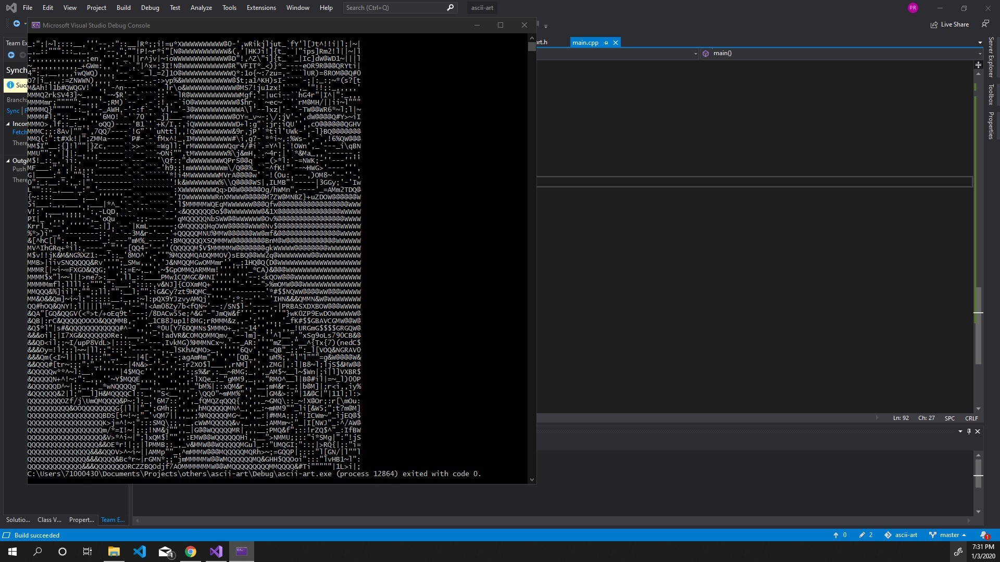

# ascii-art-generator

ASCIIArt Generator class generate ascii-art for input image.

[written in c++, microsoft visualstudio 2019 Comunity Edition.]

used [stb](https://github.com/nothings/stb) lib for reading, writing, resizing image and reading font files.

Example image used is taken from [unsplash.com](https://unsplash.com/photos/70l1tDAI6rM) submitted by Chris Lee.


ascii-art example :


```cpp
#include "image.h"
#include "fontrender.h"
#include "pixelbrightness.h"
#include "asciiart.h"

int main()
{
    /*
    uses default font:
    "./fonts/Roboto-Regular.ttf
    */
    FontRender robotoDefault;

    Image plant("../out/photo_1.jpg");
    plant.resizeWrtWidth(80);

    ASCIIArt art(&plant,&robotoDefault);
    art.generateArt();
}
```
## input


## output
with image width 80


## output
with image width 300

